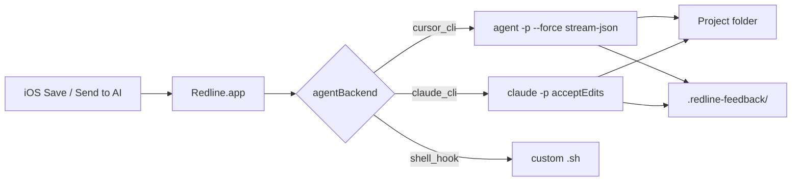
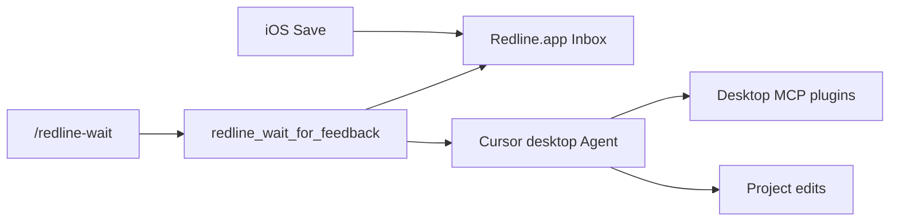

# Cursor / Claude Code — Redline agent wiring

Wire designer feedback from **Redline.app** straight into an AI agent.

## Primary: Cursor Agent CLI or Claude Code CLI



### Setup — Cursor Agent CLI

1. Install Cursor Agent CLI:
   ```bash
   curl https://cursor.com/install -fsS | bash
   ```
   Confirm: `which agent` (or `cursor agent`).

2. Launch **Redline.app** → **Settings** tab:
   - Under **When feedback arrives**, choose **Agent CLI** (or **Off — manual** / **Notify only**)
   - In the mode setup below: enable **Allow Redline to call external AI**, **Backend** = Cursor Agent CLI, **Project folder** = repo that owns your screen specs

3. Save a redline on device (or Inbox → **Send to AI**).

Redline runs headless (streaming progress into the Agent log pane):

```bash
agent -p --force --output-format stream-json --stream-partial-output "<prompt>"
```

with `cwd` = your project folder. Feedback assets are copied to `<project>/.redline-feedback/` so the agent can read `composite.png` / `feedback.json` / `prompt.md`. Add `.redline-feedback/` to your project `.gitignore`. Auth uses your Cursor login or `CURSOR_API_KEY`.

### Setup — Claude Code CLI

1. Install Claude Code:
   ```bash
   npm install -g @anthropic-ai/claude-code
   ```
   Confirm: `which claude`. Sign in with `claude` or set `ANTHROPIC_API_KEY`.

2. **Settings** tab → choose **Agent CLI** (or Off / Notify + Send to AI), then:
   - **Allow Redline to call external AI:** on
   - **Backend:** Claude Code CLI
   - **Project folder:** same repo as above
   - Optional **Claude agent path** if `claude` isn’t on PATH

3. Save / **Send to AI**.

Redline runs:

```bash
claude -p --output-format stream-json --permission-mode acceptEdits --add-dir "<bundle>" "<prompt>"
```

`--add-dir` lets Claude read the feedback bundle (outside the project) for `prompt.md` / `composite.png`.

### On new feedback modes

Settings shows one mode at a time (setup fields swap with the selection). Receiver + font size live under **Advanced**.

| Mode (Settings title) | Behavior |
|------|----------|
| **Cursor desktop (MCP)** | Store + notify; **never** auto-runs Agent CLI — use with `/redline-wait` so the desktop agent (and its MCP plugins) handle the work |
| **Agent CLI** | Auto-run Cursor/Claude/shell backend after Save (requires consent). Don’t combine with `/redline-wait` or you’ll double-trigger |
| **Notify only** | Store bundle + macOS notification; no agent until **Send to AI** |
| **Off — manual** | Store bundle only; use **Send to AI** manually |

Env override: `REDLINE_ON_NEW_FEEDBACK=off|notify|await_desktop_mcp|trigger_agent` (legacy `trigger_propose` / `trigger_auto_apply` map to trigger agent).

### Inbox status

| Status | Meaning |
|--------|---------|
| Pending | Waiting / stopped / hook ran |
| Running | Agent CLI or Cursor MCP `/redline-wait` in progress |
| Finished | Work completed (`applied`) |
| Failed | Agent or bundle error |

**Cursor MCP:** `redline_wait_for_feedback` marks the item **Running**. When finished, the agent must call **`redline_inbox_set_status`** with `applied` or `failed` (optional `summary`). CLI: `redline inbox set-status <id> applied "…"`.

You can also change status from the Inbox badge menu. Chat follow-ups in the log pane do **not** mark an item Finished.

### Output

Agent output is stored on the inbox item and in `agent-hook.log` next to the bundle under:

`~/Library/Application Support/Redline/feedback/…`

---

## Runtime context (host apps)

On Save, Redline attaches an automatic `runtime` block (app/version, device/OS, VC stack, call stack). Host apps can add:

```swift
Redline.runtimeUserInfo = ["userId": "…", "env": "staging"]
Redline.runtimeNotes = "Checkout — empty cart"
// or:
Redline.setRuntimeUserInfo(["userId": "…"])
Redline.setRuntimeNotes("…")
Redline.updateScreen(screen: "checkout", spec: "screens/checkout.screen.md", state: "empty")
```

Shown in Inbox → **App / runtime** and included in `prompt.md`.

---

## Cursor desktop (MCP + wait skill)

Use the **desktop** Agent when you need desktop MCP plugins that the headless CLI may not expose.

### From Redline.app

**Settings → When feedback arrives → Cursor desktop (MCP)**:

1. Set **Project folder** to the repo Cursor should edit.
2. Set / Detect **Redline package** (this checkout with `Package.swift`). Prefer `swift build --product redline` first so MCP uses the built binary.
3. Confirm the mode is **Cursor desktop (MCP)** (avoids double-trigger with Agent CLI).
4. **Install into project…** — writes into the **Project folder**:
   - `.cursor/mcp.json` (merges `redline` MCP; **no API token** embedded)
   - `.cursor/skills/redline-wait/SKILL.md`
   - `.cursor/commands/redline-wait.md` (slash command **`/redline-wait`**)
   - appends `.redline-feedback/` and `.cursor/mcp.json` to `.gitignore` when missing
5. Optional: **Open MCP install in Cursor** — one-click deeplink confirm dialog.

Then in Cursor: enable the `redline` MCP server if prompted, run **`/redline-wait`**, and Save a redline on device while Redline.app is listening. On Save, Redline stages assets into `<Project folder>/.redline-feedback/`.

### From CLI

```bash
swift run redline cursor setup --project /path/to/app/repo --package /path/to/redline --open
```

### Flow



---

## Fallback: shell hook

**Backend:** Shell hook — runs `hookPath <inbox-id> <bundle-dir>`.

Default script only opens `prompt.md` and leaves the item **Pending** (it does not mark Finished). Point **Agent hook** at your own script to call other tools.

CLI equivalent: `swift run redline agent run <inbox-id>` with `REDLINE_AGENT_HOOK` set.

---

## API token (optional)

If Settings → **API token** is set on the Mac app, **all** clients must send the same bearer (`POST /feedback`, `GET /health`, `GET /inbox`):

```bash
export REDLINE_API_TOKEN=your-token
```

- iOS: set in the scheme environment
- CLI: picks up `REDLINE_API_TOKEN` automatically (`swift run redline health`)
- Cursor MCP: set the env var in Cursor’s MCP server config UI — **Install into project does not write tokens** into `.cursor/mcp.json` (avoids committing secrets)

**Security:** The Mac receiver binds **loopback only** (`127.0.0.1`). Prefer Simulator for feedback, or a USB **reverse** tunnel for devices (stock `iproxy` is Mac→device and does not reach the receiver). Set an API token if other local processes share the machine.

---

## MCP (agent waits for feedback)

Prefer the [Cursor desktop setup](#cursor-desktop-mcp--wait-skill). After `swift build --product redline`, config looks like:

```json
{
  "mcpServers": {
    "redline": {
      "command": "/ABSOLUTE/PATH/TO/redline/.build/debug/redline",
      "args": ["mcp"],
      "env": {
        "PATH": "/usr/bin:/bin:/usr/sbin:/sbin:/opt/homebrew/bin:/usr/local/bin:/Applications/Xcode.app/Contents/Developer/usr/bin",
        "DEVELOPER_DIR": "/Applications/Xcode.app/Contents/Developer",
        "REDLINE_WORKSPACE_ROOT": "/ABSOLUTE/PATH/TO/YOUR/APP/REPO"
      }
    }
  }
}
```

If no binary exists, install falls back to `swift run --package-path … redline mcp`.

Then: `redline_wait_for_feedback` → read `.redline-feedback/` → edit → **`redline_inbox_set_status`** (`applied` / `failed`). Slash command: `/redline-wait`. MCP JSON omits the PNG base64 (`compositeOmitted`); open `composite.png` on disk.

CLI:

```bash
swift run redline inbox list
swift run redline inbox show <id>
swift run redline agent run <id>   # shell hook only
swift run redline gates run --workspace "$REDLINE_WORKSPACE_ROOT" --bundle "$REDLINE_BUNDLE_DIR"
```

Gates validate feedback bundles via CLI/MCP only — the Mac app does not auto-run gates after an agent completes.
